# Git Workflow Diagram

Sơ đồ này mô tả luồng Git chuẩn cho dự án: phát triển tính năng trên `feature/*`, hợp nhất vào `dev`, chuẩn bị phát hành bằng `release/*`, và chỉ đưa lên production từ `main`.

```mermaid
flowchart LR
  classDef branch fill:#111827,stroke:#60a5fa,color:#f9fafb,stroke-width:1px;
  classDef stage fill:#0f172a,stroke:#34d399,color:#e5e7eb,stroke-width:1px;
  classDef danger fill:#2b0f14,stroke:#f87171,color:#fee2e2,stroke-width:1px;
  classDef ok fill:#082f49,stroke:#38bdf8,color:#e0f2fe,stroke-width:1px;

  A[(Developer)]:::stage --> B[feature/<br/>new-ticket-flow]:::branch
  B --> C[Pull Request]:::stage
  C --> D[Code Review]:::stage
  D --> E[CI Checks<br/>lint · test · audit · build]:::ok
  E --> F{Pass?}:::stage
  F -- No --> B
  F -- Yes --> G[dev]:::branch
  G --> H[Dev deploy<br/>GitOps / Argo CD]:::ok
  H --> I[QA / UAT]:::stage
  I --> J{Ready to release?}:::stage
  J -- No --> G
  J -- Yes --> K[release/<br/>vX.Y.Z]:::branch
  K --> L[Release hardening<br/>bugfix · changelog · tag]:::ok
  L --> M[main]:::branch
  M --> N[Production deploy]:::danger
  M --> O[Hotfix/<br/>urgent-fix]:::branch
  O --> P[Patch PR]:::stage
  P --> M

  subgraph Pipeline["CI / CD Pipeline"]
    P1[Install]:::stage --> P2[Test]:::stage --> P3[Security audit]:::stage --> P4[Build image]:::stage --> P5[Push image]:::stage --> P6[Deploy dev]:::stage
  end

  G -. triggers .-> P1
  K -. triggers .-> P1
  M -. triggers .-> P1
```

## Quy ước nhánh

- `main`: nguồn chính cho production.
- `dev`: nhánh tích hợp hàng ngày, tự động deploy môi trường dev.
- `feature/*`: nhánh làm tính năng, không commit trực tiếp vào `dev`.
- `release/*`: nhánh đóng gói phát hành, chỉ nhận bugfix nhỏ.
- `hotfix/*`: nhánh sửa lỗi khẩn cấp trên production.

## Quy ước triển khai

- Mỗi lần merge vào `dev` sẽ chạy kiểm tra chất lượng, build image và push lên registry.
- Khi tạo `release/*`, pipeline dùng cùng bộ kiểm tra nhưng chỉ deploy sau khi pass full gate.
- Production chỉ nhận từ `main` hoặc nhánh hotfix đã được review.

## Mẫu tag image

- `ticket-booking-backend:dev-<short-sha>`
- `ticket-booking-backend:release-vX.Y.Z`
- `ticket-booking-backend:prod-vX.Y.Z`

## Gợi ý bảo vệ nhánh

- Bắt buộc pull request review cho `main` và `dev`.
- Bắt buộc pass `lint`, `test`, `audit`, `build`.
- Chặn force-push trên `main`, `dev`, `release/*`.
- Chỉ cho phép tag release từ pipeline hoặc maintainer được phân quyền.
